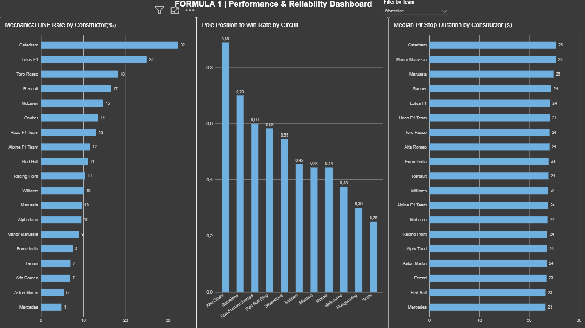

Formula 1 Hybrid Era Analysis (2014–Present)

Data analysis project exploring Formula 1 performance, pit stop efficiency, and reliability during the Hybrid Era (2014–Present) using Python and Pandas.

Executive BI Dashboard

Executive Summary: Interactive business intelligence dashboard built in Power BI visualizing circuit pole-to-win conversion rates, constructor pit stop duration medians, and power-unit mechanical reliability metrics.

Key Insights

Pit Stop Consistency: Mercedes (23.26s) and Red Bull Racing (23.28s) recorded the fastest median pit lane times across the hybrid era. Top teams gain roughly 2 seconds per stop compared to backmarkers.
Pole-to-Win Rate: Across the era, starting from P1 resulted in a win 52.6% of the time. Tracks like Abu Dhabi (88.9%) and Barcelona (70.0%) showed high pole conversion, while Sochi (25.0%) suffered due to the long slipstream run into Turn 1.
Mechanical Reliability: Mercedes had the lowest mechanical DNF rate on the grid (4.9%), directly supporting their championship wins. Teams with higher failure rates (McLaren at 14.7%, Renault at 16.5%) lost heavy points despite competitive race pace.

Project Update - Race Winner Prediction (Machine Learning)

As an extension to the descriptive analysis, a machine learning pipeline was implemented to predict race winners using a `RandomForestClassifier`.

Leakage Prevention: Features use a chronological split and rolling driver points strictly shifted by one race (`.shift(1)`).
Model Evaluation: Evaluated on the minority winning class (`is_winner = 1`) with Precision: 0.71, Recall: 0.44, and F1: 0.55.
Probability Inference: Evaluated with `predict_proba` for the 2023 Abu Dhabi GP, correctly predicting Max Verstappen as the top favorite (59.6% win probability).
  
Tech Stack

Python
Pandas (data cleaning, aggregations, merges)
Matplotlib (data visualizations)
Jupyter Notebook
Scikit-learn

Data Source

The project uses the historical Ergast / Kaggle Formula 1 dataset covering races, results, pit stops, and constructors from the 2014 season onward.
